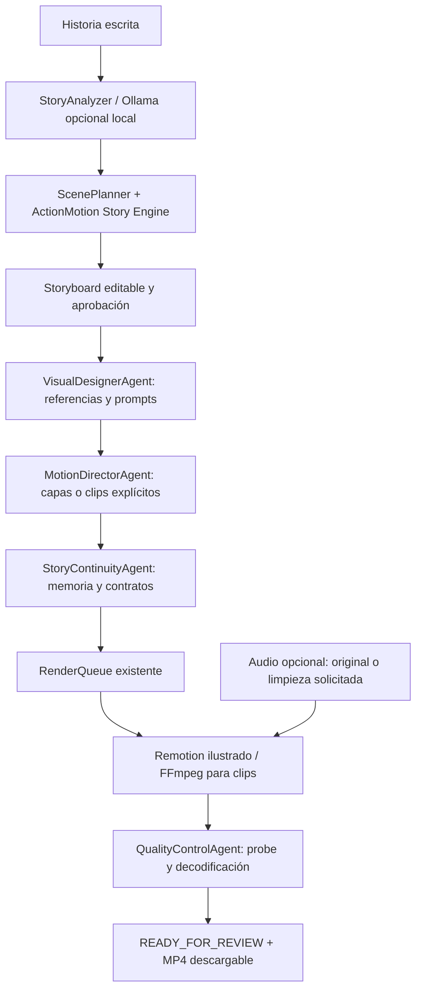

# ActionMotion — implementación y límites comprobables

Prueba adicional de 120 segundos con narración local real: [resultado end-to-end y límites](ACTIONMOTION-E2E-120.md). Esta prueba verifica el alcance ilustrado 2.5D; no habilita el modo cinematográfico generativo.

## Resultado y auditoría

Evolución de StoryMotion, sin reconstruir el producto ni integrar ClipForge. Punto de partida: `main`, commit `670fffa96063737515db0a7b9168076025707819`, Git limpio e igual a origin/main. Rama de implementación: `feat/actionmotion-director-ai`. La web de producción no se modifica ni se crean servicios de pago.

Se reutilizan Next.js 16, React 19, TypeScript, Remotion 4, FFmpeg/FFprobe, Sharp, SQLite y filesystem. Se preservan proyectos JSON antiguos, biblioteca/importación de imágenes, edición de planos, transiciones, narración Piper opcional, música, caché de render y descarga móvil. Los identificadores técnicos `StoryMotion`, variables `STORYMOTION_*`, base de datos y usuario de acceso se mantienen por compatibilidad; la interfaz de esta rama se llama ActionMotion.

Recursos observados: CPU de 2 núcleos, 8 GB de RAM, aproximadamente 1,6 GB de disco libre al comenzar las verificaciones. No hay dispositivos NVIDIA/GPU ni modelos de imagen a video instalados. No se instalaron pesos ni se contrataron APIs. Estos recursos permiten renderizar ilustraciones y montar video existente, pero no justifican prometer generación humana realista.

**El objetivo cinematográfico solicitado es PARCIAL y su prueba de aceptación de movimiento humano generado está BLOQUEADA.** Un MP4 válido no equivale a un resultado cinematográfico aceptado.

## Capacidades y estado

| Función                                         | Estado                   | Evidencia y límite                                                                               |
| ----------------------------------------------- | ------------------------ | ------------------------------------------------------------------------------------------------ |
| Director persistente, aprobación y recuperación | FUNCIONAL                | SQLite transaccional, snapshots, worker y pruebas de reinicio/revisión                           |
| Seis responsabilidades especializadas           | FUNCIONAL                | Módulos en el mismo proceso, sin seis servicios o modelos separados                              |
| Story Engine y storyboard por acciones          | PARCIAL                  | Reglas locales identifican acciones y sujetos; lenguaje complejo requiere revisión               |
| Análisis Ollama                                 | PARCIAL                  | Adaptador HTTP estructurado implementado; modelo/servidor no instalado ni probado con inferencia |
| CharacterBible y memoria de continuidad         | FUNCIONAL para contratos | Identificadores, apariencia, ropa, referencias, luz, dirección, posición y estados narrativos    |
| Verificación de identidad en píxeles            | PENDIENTE                | No existe reconocimiento facial ni evaluación aprendida de anatomía                              |
| Animación articulada de ilustraciones           | FUNCIONAL                | Brazos/piernas, respiración, tela, giro esquemático de cabeza, lluvia, cámara y parallax         |
| Actuación humana fotorealista generada          | BLOQUEADO                | No hay modelo temporal operativo ni GPU disponible                                               |
| Clips de video importados                       | FUNCIONAL                | Normalización, recorte, referencias de primer/último fotograma, montaje y descarga               |
| Adaptador a comando local de generación         | PARCIAL                  | Contrato y validación implementados; ejecutable/modelo real e integración al director pendientes |
| Interpolación óptica                            | FUNCIONAL                | FFmpeg minterpolate sobre clips importados; no inventa acciones ni mejora anatomía               |
| Superresolución aprendida                       | PENDIENTE                | Lanczos solo reescala; no se declara creación de detalle                                         |
| Audio importado con original conservado         | FUNCIONAL                | Archivo original idéntico, opción sin filtros, limpieza solicitada y AAC opcional                |
| QA técnico de MP4                               | FUNCIONAL                | Resolución, codec, FPS, duración, streams, decodificación, alertas de congelación/negro          |
| QA de deformaciones, parpadeo o rostros         | PENDIENTE                | Se muestran límites y se requiere revisión humana                                                |
| Rápido y equilibrado                            | FUNCIONAL                | 540×960 CRF28 y 1080×1920 CRF20; opciones de 24/30 FPS                                           |
| Cinematográfico y modo generativo               | BLOQUEADO                | Desactivados; la API rechaza la solicitud sin sustitución silenciosa por 2.5D                    |
| Proveedor ficticio en pruebas del adaptador     | SIMULADO                 | Valida transporte y caché; no cuenta como inferencia ni motor generativo                         |

## Arquitectura



El director coordina `VisualDesignerAgent`, `MotionDirectorAgent`, `StoryContinuityAgent`, `AudioEngineerAgent`, `VideoEditorAgent` y `QualityControlAgent`. Son código funcional que comparte contexto, no agentes independientes que inventan respuestas ni seis modelos ejecutándose. Sin Ollama instalado el análisis y las decisiones se realizan por reglas; la interfaz lo identifica.

`ActionMotionStoryEngine` agrega clima, iluminación, objetos, actores, estado inicial/final y conexión al siguiente plano al modelo existente. `ActionMotionCinematicDirector` elige tomas y transiciones justificadas. Una indicación lateral/sobre el hombro es dirección para un motor futuro, no una reconstrucción 3D del escenario. Los movimientos de cámara 2.5D disponibles siguen siendo editables.

`VisualDesignerAgent` conserva referencias importadas/generadas por personaje y lugar y produce prompts completos con estilo, época, iluminación y contexto. `MotionDirectorAgent` guarda hashes de apariencia, posiciones de entrada/salida y primer/último fotograma de clips, junto con referencias al plano anterior. La continuidad comprueba definiciones y referencias; no puede demostrar que una cara generada conserve su identidad sin inspeccionar sus píxeles con otro sistema.

## Trabajos, autorización y recuperación

Estados: `PENDING → ANALYZING → STORYBOARD → GENERATING → ANIMATING → RENDERING → QUALITY_CHECK → READY_FOR_REVIEW`, más `FAILED` y `CANCELED`.

La tabla SQLite `agent_jobs` usa BEGIN IMMEDIATE para encolar/claimar y guarda revisión, snapshot, eventos, errores y escenas terminadas. El worker existente procesa pasos del director y renders. Se recuperan trabajos de procesos muertos mediante PID más identidad de inicio para evitar confundir un PID reutilizado. La aprobación valida la revisión actual; una edición concurrente no se sobrescribe. Un storyboard aprobado permite producción local, no gastos ni publicación.

Valores iniciales:

```dotenv
ACTIONMOTION_AGENT_ENABLED=true
ACTIONMOTION_AGENT_MODE=SEMI_AUTO
ACTIONMOTION_REQUIRE_APPROVAL=true
ACTIONMOTION_EXTERNAL_PAID_CALLS=false
```

Hay hasta tres intentos con espera exponencial. Un error de render se muestra y permite reintento. Escenas ya guardadas no se generan otra vez; se reutilizan assets y caché. La clave de render por director es estable para evitar duplicar su salida tras reiniciar. Si el usuario edita después de un fallo, debe iniciar una nueva producción con la revisión corregida; no se aplica un snapshot antiguo sobre su edición.

Cancelar evita las siguientes fases y descarta la entrega de ese trabajo. Un render de un plano en curso termina su operación antes de comprobar cancelación: no se promete interrupción instantánea. Cola y storage son de un único host; no se implementaron coordinación distribuida ni escalado horizontal.

Las llamadas HTTP comerciales de imagen y análisis permanecen desactivadas en la configuración inicial. Con `REQUIRE_APPROVAL=true` también se bloquean aunque se active la bandera de llamadas pagas: todavía no hay autorización por operación/proveedor/presupuesto para esos servicios. El director solo utiliza recursos locales. Ollama admite únicamente una URL HTTP loopback y necesita un servidor/modelo instalado por el operador.

## Video, movimiento y calidad

El render de ilustraciones reutiliza Remotion. Solo assets provisionales de personaje emplean el rig SVG articulado; fotos y PNG importados conservan el comportamiento de capas. No se transforma una fotografía en un cuerpo humano animado. La calle ilustrada y su lluvia son recursos procedurales, sin generación de imágenes IA.

Un clip real utiliza `ClipManager` y FFmpeg, no una fotografía con zoom: importación de hasta 50 MB/120 segundos, salida base H.264 1080×1920 30 FPS sin audio, recorte central cuando hace falta, referencias de primer/último frame y caché por contenido. Se advierte si se reescala una fuente menor. El plano no puede superar la duración real disponible del clip ni congelarlo silenciosamente para cubrirla. Entre clips se usan cortes limpios. La interpolación opcional se ejecuta a resolución de origen antes del reescalado para reducir carga.

Los avisos de fuente menor, recorte e interpolación aparecen en la revisión del director. El montaje rechaza una transición no admitida entre clips en lugar de representar el clip mediante su antigua ilustración. Un proyecto compuesto solo por clips no abre Chromium, y las imágenes conservadas como respaldo de esos clips no son necesarias para exportarlo. Estas condiciones se verificaron con un clip real y una imagen deliberadamente ausente.

Rápido exporta 540×960, equilibrado 1080×1920. La escala de Remotion conserva la composición lógica de 1080×1920. H.264 y yuv420p favorecen compatibilidad móvil; no se añade marca de agua propia. Los MP4 sin audio tienen cero streams de audio, no una pista de silencio.

Se reparó un fallo descubierto por la prueba completa: clips FFmpeg con time base 1/15360 mezclados con Remotion 1/90000 causaban FPS erróneos. El montaje normaliza las bases mediante remux sin recodificar y conserva los límites sobre la cuadrícula de fotogramas. Hay una prueba de regresión que mezcla ambas bases y comprueba cada timestamp y número de frames.

El control de calidad decodifica el archivo completo y comprueba codec, resolución, FPS, duración y AAC opcional. `freezedetect` y `blackdetect` agregan avisos de inmovilidad o negro prolongado. No determinan si un corte es artísticamente correcto ni detectan deformaciones, manos o expresiones. Los avisos no se ocultan como correcciones resueltas.

## Audio opcional y original

Los proyectos nuevos comienzan sin audio. La narración Piper que ya existía sigue siendo opcional; el texto continúa siendo la fuente del storyboard. No se añadió Whisper, transcripción ni dependencia de voz.

Importación hasta 50 MB/10 minutos. El archivo original se conserva byte por byte y puede descargarse. La opción inicial **Conservar sin filtros** no aplica denoise, EQ, compresión ni loudness: copia AAC compatible o convierte para exportar. La versión original sigue disponible aun cuando la conversión sea necesaria.

La limpieza se ejecuta solamente cuando se solicita: filtros de voz, denoise opcional, compresión y loudnorm de dos pasadas con medición del resultado, objetivo −16 LUFS/−1,5 dBTP. El resultado para video usa AAC 48 kHz/192 kbps. No restaura una grabación que ya está saturada. Se puede añadir música propia mediante el mezclador existente y ajustar un offset; no se usa transcripción para sincronizar. Si el audio importado no cabe, la app pide ampliar el storyboard, no lo recorta silenciosamente.

## Interfaz y API

Diseño móvil con supervisión del director, fase, porcentaje, eventos, seis responsabilidades, avisos, aprobación, cancelar, reintentar y video final. El storyboard distingue **clip importado** de **ilustración por capas 2.5D**. El editor conserva la edición parcial y permite reemplazar solamente el clip de un plano. Audio permite conservar/limpiar y descargar el original. El modo generativo y la calidad cinematográfica se muestran bloqueados.

Rutas nuevas:

- `GET /api/agent/capabilities`
- `GET/POST /api/projects/:id/director`
- `GET /api/agent-jobs/:id`, `POST .../approve`, `.../retry`, `.../cancel`
- `POST /api/projects/:id/scenes/:sceneId/clip`
- `GET/HEAD /api/clips/:id/video`, `GET .../first-frame`, `.../last-frame`
- `POST /api/projects/:id/audio/import`
- `GET /api/audio-assets/:id`, `GET .../original?download=1`

Los renders no bloquean HTTP. La normalización inicial de uploads sí es síncrona y constituye una limitación conocida; para clips grandes conviene trasladarla a la misma cola persistente en una fase posterior. Se mantiene el acceso de propietario único; no se eliminó su contraseña ni se añadió un sistema multiusuario.

## Motores evaluados, sin contratar ni activar

Fuentes oficiales consultadas el 10 de octubre de 2026. Las cifras son del proveedor, no pruebas de rendimiento en este entorno.

| Motor                                                                   | Movimiento/controles                                                                                     | Infraestructura                                                                         | Costo y tiempo                                                                                         | Situación en ActionMotion                                      |
| ----------------------------------------------------------------------- | -------------------------------------------------------------------------------------------------------- | --------------------------------------------------------------------------------------- | ------------------------------------------------------------------------------------------------------ | -------------------------------------------------------------- |
| [Wan 2.2 TI2V-5B](https://github.com/Wan-Video/Wan2.2)                  | Texto/imagen a video temporal, 720p24; consistencia requiere referencias y evaluación                    | Ejemplo oficial: GPU con al menos 24 GB VRAM, offload y T5 en CPU                       | Sin tarifa de API local; GPU/electricidad/alquiler no cotizados. Tiempo depende GPU                    | PENDIENTE; no instalado ni probado; 1080 implicaría reescalado |
| [LTX-Video](https://github.com/Lightricks/LTX-Video)                    | Video temporal; condicionamiento por fotogramas, extensión y variantes con controles de pose/profundidad | CUDA/PyTorch y memoria según checkpoint/precisión/offload; no se asume mínimo universal | Modelos distilled reducen tiempo/recursos con compromisos de calidad. Benchmark local pendiente        | PENDIENTE; no instalado ni probado                             |
| [Runway Gen-4 Turbo API](https://docs.dev.runwayml.com/guides/pricing/) | Imagen a video en nube; preservación de identidad no garantizada por contrato                            | Clave, presupuesto y aprobación; no necesita GPU local                                  | 5 créditos/segundo × USD0,01: USD0,05/s; 5 s ≈ USD0,25, 60 s ≈ USD3, sin imágenes/reintentos/impuestos | PENDIENTE; no adaptador específico, clave ni llamadas          |
| FFmpeg optical flow                                                     | Fotogramas intermedios entre imágenes de un clip; no acciones nuevas                                     | CPU, sensible a resolución/duración                                                     | Sin API; tiempo medido con pruebas pequeñas                                                            | FUNCIONAL, opción explícita                                    |
| Remotion ilustrado / video importado                                    | Rig ilustrado o movimiento presente en el clip                                                           | CPU, Chromium, FFmpeg; stack actual                                                     | Sin llamada generativa; procesamiento local                                                            | FUNCIONAL con límites descritos                                |

El contrato `VideoProvider` recibe prompt, referencias de identidad, inicio/final, duración, FPS, seed y clave de idempotencia. `LocalCommandVideoProvider` ejecuta un adaptador instalado por el operador, sin shell, con timeout y validación de salida. Guarda un manifiesto de solicitud: no reutiliza un MP4 de otra solicitud ni reejecuta un resultado existente sin comprobar su procedencia. Este contrato no instala un modelo, no demuestra inferencia y todavía no activa el modo generativo en el director. Un motor tendrá que declarar controles admitidos y superar la prueba cinematográfica antes de habilitarse.

## Reproducir las pruebas

```bash
npm ci
npm test
npm run typecheck
npm run build
npm run test:e2e
npx tsx scripts/actionmotion-demo.ts
```

La prueba móvil cubre navegador → API → SQLite → aprobación → importación de clip/audio → render real → control de calidad → preview y descarga. Usa un patrón de video móvil y señal de audio sintéticos para medir el flujo, nunca como ejemplo de video generativo. La prueba de la calle lluviosa conserva protagonista/chaqueta negra y descompone caminar, escuchar, detenerse, girar, observar y correr. Su preview usa ilustraciones articuladas y está declarado **PARCIAL**; el criterio de caminar/correr naturalmente en video IA está **BLOQUEADO**.

## Verificación final y archivos entregados

Resultados sobre esta implementación:

- **40 pruebas automatizadas aprobadas** en la suite completa. Después de las últimas protecciones se repitieron los módulos afectados: director, video y audio, todos aprobados.
- **TypeScript y compilación Next.js de producción aprobados.** Se comprobó también el build compilado en un servidor local: teléfono 390×844, historia lluviosa, ocho planos, chaqueta negra persistente, pausa para aprobación del storyboard, cancelación y cero errores de página. Este servidor de prueba no es un despliegue en Render.
- **Playwright: 5 aprobadas y 1 omitida** en la ejecución final secuencial. La omitida necesita el ejecutable/modelo Piper configurado; la importación y exportación de audio sí se probaron con archivos reales.
- Flujo móvil completo probado: crear, analizar, guardar/reabrir, editar, reemplazar solo un plano por video, importar audio, aprobar, renderizar, decodificar, reproducir y descargar. Se verificó el original de audio byte por byte y una exportación adicional con cero streams de audio.
- Se verificó un proyecto de solo clips con `CHROME_EXECUTABLE` apuntando a una ruta inexistente y una imagen de respaldo ausente: exportó correctamente usando FFmpeg. Se verificaron avisos de fuente de baja resolución y rechazo de transiciones no admitidas.
- Se comprobó que cancelar un director alcanza un render encolado antes de guardar su enlace, y que ese director cancelado no puede encolar otro render.
- Prettier y `git diff --check` aprobados. No se modifican `main`, el servicio publicado, credenciales ni recursos pagos.

Problemas encontrados y corregidos: timestamps de MP4 con bases de tiempo distintas; el patrón de acción `entr` interpretaba incorrectamente “mientras”; dirección automática sobrescribía una cámara editada; cancelación podía dejar un render sin enlazar; clips dependían innecesariamente de imágenes antiguas/Chromium. En las primeras pruebas se editaron fuentes durante el arranque y dos ejecuciones Playwright compartieron el directorio de traces. Se corrigió el selector de importación y se repitieron las pruebas secuencialmente, sin esos fallos.

| Archivo                                                                                                               | Comprobación                                                                 | Alcance                                                                            |
| --------------------------------------------------------------------------------------------------------------------- | ---------------------------------------------------------------------------- | ---------------------------------------------------------------------------------- |
| [Calle lluviosa — preview](actionmotion-rain-preview.mp4)                                                             | H.264, 1080×1920, 30 FPS, 12 s, 360 frames, cero audio                       | Ilustración articulada, **PARCIAL**. No satisface actuación humana generativa      |
| [Reporte de la calle lluviosa](actionmotion-rain-verification.json) / [plan guardado](actionmotion-rain-project.json) | Identidad, chaqueta negra, ocho planos, clima, acciones, probe, SHA256       | Aceptación cinematográfica **BLOQUEADA**, explícita en el reporte                  |
| [Fotogramas de la muestra](actionmotion-rain-frames.jpg)                                                              | Inspección visual de ropa, figura de fondo y mismo lugar                     | Gait y giro son esquemáticos; no anatomía/física realista                          |
| [Prueba móvil de montaje y audio](actionmotion-demo.mp4) / [reporte](actionmotion-verification.json)                  | H.264, 1080×1920, 30 FPS, 6,033333 s, un stream AAC                          | Clip de patrón sintético más ilustraciones; audio de señal sintética, no narración |
| [Vista móvil](actionmotion-mobile.png)                                                                                | Viewport 390×844, sin desbordamiento, reproducción y descarga                | Supervisión real del director                                                      |
| [Preview rápido](actionmotion-fast-preview.mp4) / [reporte](actionmotion-fast-verification.json)                      | H.264, 540×960, 24 FPS, 2 s, cero audio                                      | Prueba técnica de escala/FPS; ritmo muy comprimido, no película terminada          |
| [Prueba del build compilado](actionmotion-production-smoke.json)                                                      | API, SQLite, storyboard pendiente de aprobación y cancelable, interfaz móvil | Servidor local de prueba, sin despliegue público                                   |

El demo anterior de 30 segundos también exportó H.264 1080×1920/30 con cero audio y se comprobó su descarga por rangos. No se entrega como evidencia de video generativo.

Tiempos registrados con trabajos y pruebas concurrentes en CPU: preview lluvioso 315,691 s; preview rápido 88,272 s. La ejecución móvil final registra su tiempo exacto en el reporte JSON. Estos valores incluyen análisis, materiales, arranque, render y QA, y no son benchmarks de un motor GPU ni estimaciones para Render. La CPU y el arranque de Chromium limitan el rendimiento de las ilustraciones; la caché evita recalcular planos intactos.

Archivos principales:

- Director/cola/capacidades: `src/lib/director/`, `scripts/worker.ts`, `.env.example`.
- Narrativa y continuidad: `src/lib/story/ActionMotionStoryEngine.ts`, `StoryAnalyzer.ts`, `ScenePlanner.ts`, contratos en `src/lib/domain.ts`.
- Movimiento y video: `src/lib/video/`, `src/remotion/layers/ArticulatedCharacter.tsx`, `SceneVisual.tsx`, `StoryComposition.tsx`, `src/lib/render/`.
- Audio: `src/lib/audio/ImportedAudio.ts`, `AudioManager.ts`.
- Interfaz: `Studio.tsx`, `AgentPanel.tsx`, `AudioPanel.tsx`, `PreviewPlayer.tsx`, páginas, estilos y manifest.
- Pruebas: `tests/director.test.ts`, `tests/video.test.ts`, `tests/ffmpeg.test.ts`, `e2e/director.spec.ts` y regresiones existentes.
- Evidencia reproducible: `scripts/actionmotion-demo.ts`; añadir `--fast` para la prueba 540×960/24. Inventario completo en [actionmotion-files.txt](actionmotion-files.txt).

La revisión se encuentra en [PR #1](https://github.com/thomassabes243-tech/storymotion/pull/1), en borrador. Los commits se separan en director persistente, narrativa/movimiento/video, audio, interfaz/API, cancelación/solo clips, avisos de calidad y documentación/evidencia. La rama no se fusiona ni despliega automáticamente.

## Pendiente para cumplir el objetivo cinematográfico

1. Elegir e instalar un motor temporal concreto en GPU compatible, o autorizar un proveedor de nube con presupuesto y clave. Integrarlo al director y declarar sus controles reales; el adaptador genérico no sustituye ese trabajo.
2. Instalar y evaluar un modelo local de comprensión narrativa si se desea superar las reglas actuales.
3. Generar la prueba de la calle lluviosa con actuación humana natural, comprobar identidad/vestimenta, continuidad de caminar/parar/girar/correr y estabilidad temporal. La muestra ilustrada no cuenta como aprobado.
4. Añadir QA aprendido o revisión asistida para caras, manos, anatomía y parpadeo; actualmente solo se auditan contratos y archivo/render.
5. Completar autorización por operación/presupuesto para proveedores comerciales antes de habilitar sus llamadas. Ninguna aprobación local de storyboard habilita gastos.

**No se declara terminado el estudio cinematográfico generativo.** Se entrega un flujo local funcional y verificable, con integración y recursos necesarios identificados, preservando la aplicación anterior y su producción.

Prueba adicional: [la traición de Judas, 23 tomas y narración local, 69,87 s](ACTIONMOTION-E2E-JUDAS.md).
